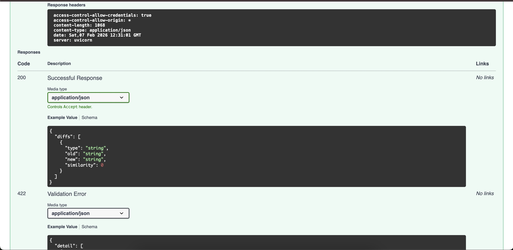
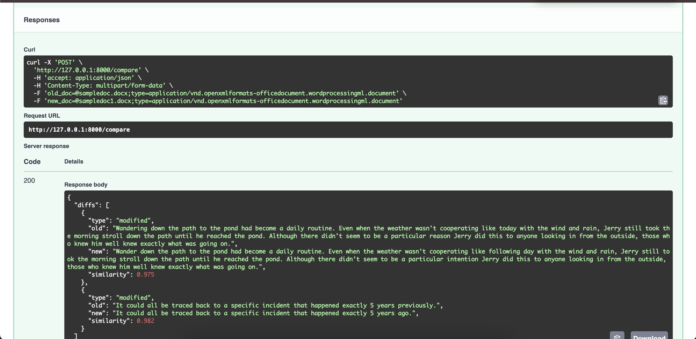
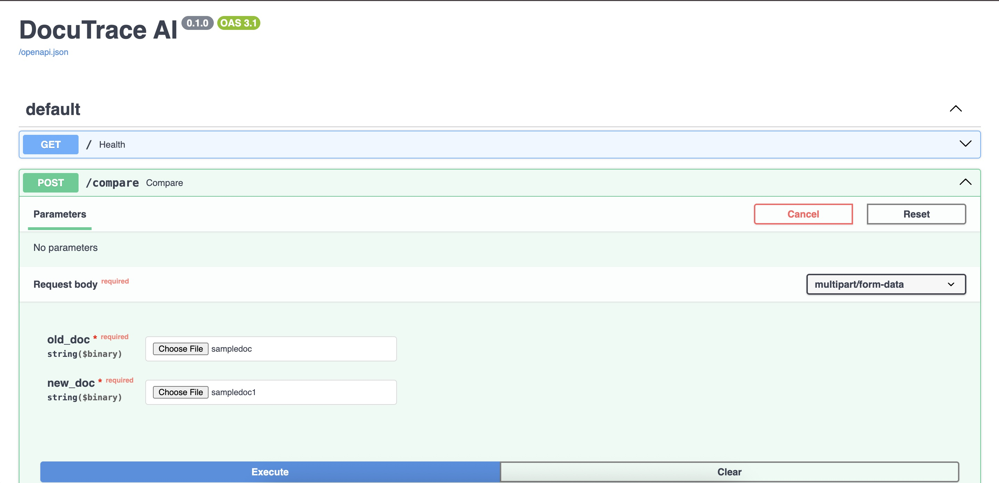

# DocuTrace AI 📄🔍

DocuTrace AI is a powerful document management and analysis platform that uses artificial intelligence to help you track changes, extract insights, and query your documents with natural language.

## Key Features

- **Automated Ingestion**: Seamlessly upload PDF and DOCX documents.
- **Semantic Diff Engine**: Identify changes between document versions beyond simple text matching—understand *what* actually changed.
- **Intelligent Q&A**: Ask questions about your documents in plain English and get precise answers using our integrated RAG (Retrieval-Augmented Generation) pipeline.
- **Version Control**: Keep a historical record of document versions and their evolution over time.

## Screenshots

### Dashboard


### Document Upload


### Semantic Comparison


### AI Question Answering


## Tech Stack

- **Backend**: FastAPI (Python)
- **Database**: PostgreSQL
- **AI/ML**: 
  - `Sentence-Transformers` for semantic embeddings.
  - `FAISS` for efficient vector similarity search.
  - `HuggingFace Transformers` (RoBERTa) for extraction-based Q&A.
- **Deployment**: Docker & Docker Compose

## Getting Started

### Prerequisites

- Docker and Docker Compose installed.

### Installation

1. Clone the repository:
   ```bash
   git clone <repository-url>
   cd docutrace-ai
   ```

2. Start the application:
   ```bash
   docker-compose up --build
   ```

The API will be available at `http://localhost:8000`. You can explore the interactive API documentation at `http://localhost:8000/docs`.

## Project Structure

- `backend/`: FastAPI application, AI logic, and database models.
- `screenshots/`: Project UI walkthrough images.
- `docker-compose.yml`: Infrastructure orchestration.

## License

MIT
